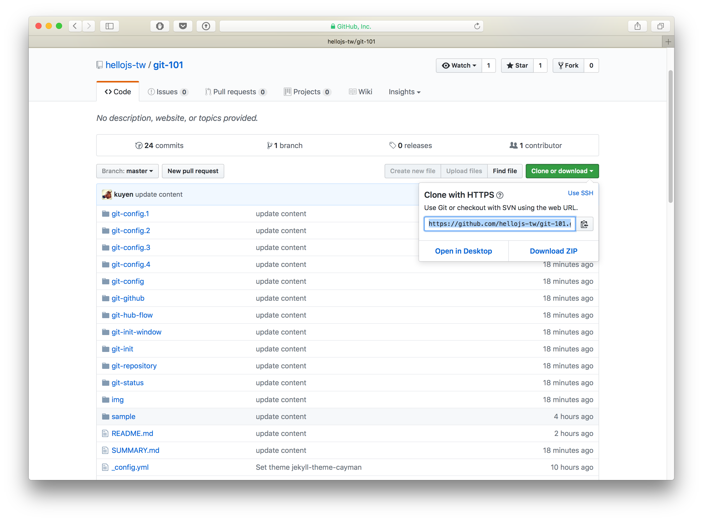
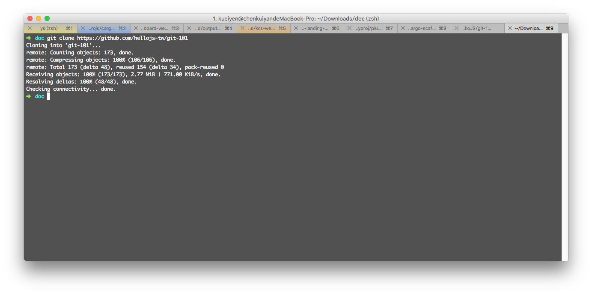
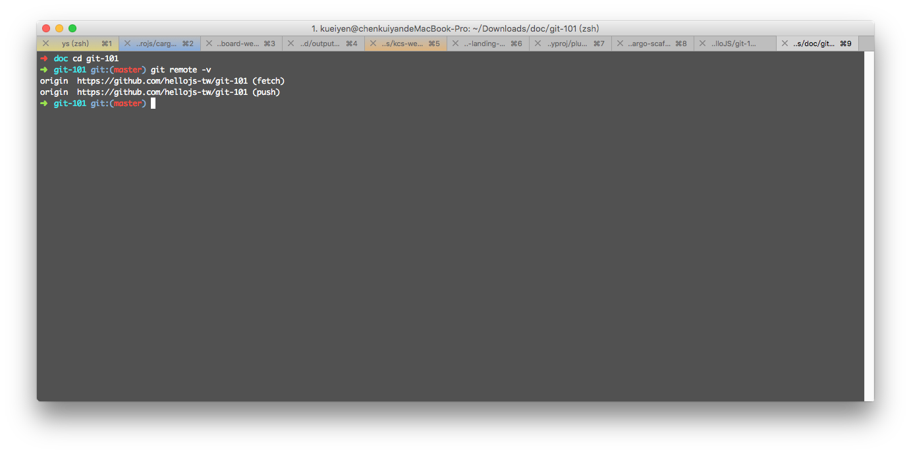

# git clone/remote

## 目錄
- [回目錄](../SUMMARY.md)

***


## 前置準備 - 由遠端取得 git 儲存庫路徑

開啟以下網址後點選綠色的 `Clone or Download` 按鈕，複製出現的 `https:/..` 開頭字串。如果沒有，點選旁邊的藍色小字 `Use HTTPS`。
```
https://github.com/hellojs-tw/git-101
```




## 前置準備 - 切換資料夾

由於上一個步驟已經建立好一個全新的 git 儲存庫，但現在需要離開該儲存庫到乾淨不含有 git 的路徑。

#### Mac/Ubuntu 使用者打開終端機後輸入以下指令：

// 切換至家目錄
```
cd ~
```

// 建立 `git-101` 資料夾
```
mkdir git-101
```

// 切換至剛建立好的資料夾
```
cd git-101
```

#### Windows 使用者打開終端機後輸入以下指令：

// 切換至根目錄
```
cd C:
```

// 建立 `git-101` 資料夾
```
mkdir git-101
```

// 切換至剛建立好的資料夾
```
cd git-101
```

## 使用 git clone

// 使用 git clone 取得遠端的 repository
```
git clone https://github.com/hellojs-tw/git-101
```



### 進階用法

// 取得遠端 repository 的同時重新命名複製到本地端的目錄名稱
```
git clone https://github.com/hellojs-tw/git-101 my-git-101
```

## 使用 git remote 查看遠端路徑

// 輸入以下指令查看遠端 repository 路徑
```
cd git-101
git remote -v
```



## 小結
- 學會使用 `git clone` 取得遠端的 repository
- 學會使用 `git remote -v` 指令查看遠端 repository 路徑

***

## 下一頁
- [回目錄](../SUMMARY.md)
- [git add/commit](../git-add/commit/index.md)